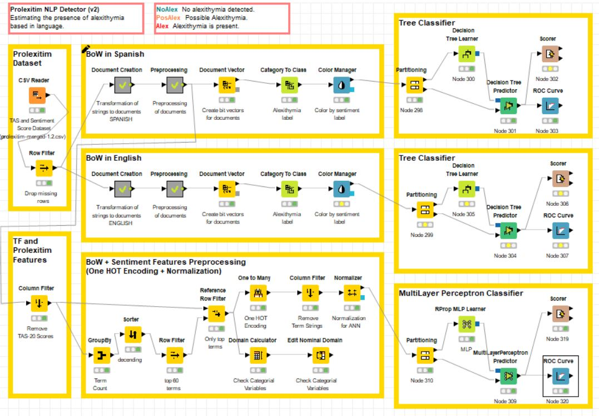
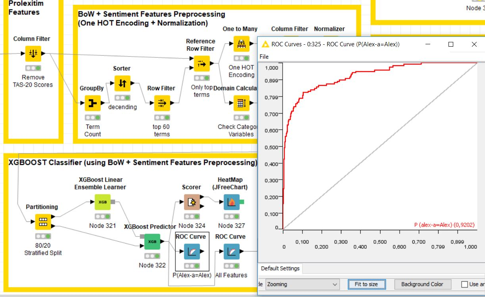
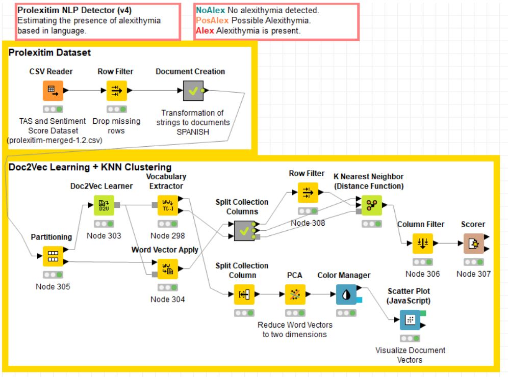

# prolexitim-analytics / KNIME Workflows
Data Analytics for Prolexitim Product Line

May 2019.  Prolexitim dataset version 1.2 (MPGS-TFM-Submission).  
Raúl Arrabales Moreno (Psicobótica / Serendeepia Research) 
<a target="_blank" href="http://www.conscious-robots.com/">http://www.conscious-robots.com/</a>  

- **ProlexitimPredictorNoTA:** Machine Learning Classifiers for Alexithymia (with no Text Analytics, just from sentiment scores). 

- **ProlexitimPredictorPLN:** Machine Learning Classifiers for Alexithymia (using BoW and TF/IDF). 

- **ProlexitimPredictorPLN-v2:** Machine Learning Classifiers for Alexithymia (using BoW, TF and Prolexitim Features. AUC > 0.8 using a MultiLayer Perceptron). 

- **ProlexitimPredictorPLN-v3:** XGBoost (gradient boosted decision trees) Classifier for Alexithymia (using BoW, TF and Prolexitim Features. AUC > 0.9). 

- **ProlexitimPredictorPLN-v4:** KNN Clustering for Alexithymia based on learned Word2Vec. 

